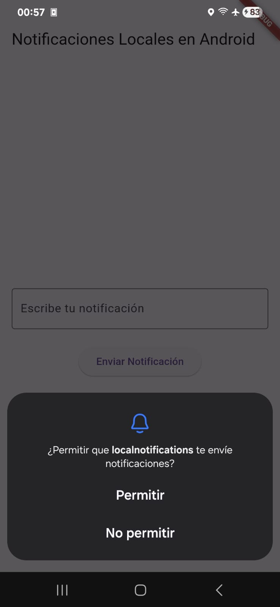
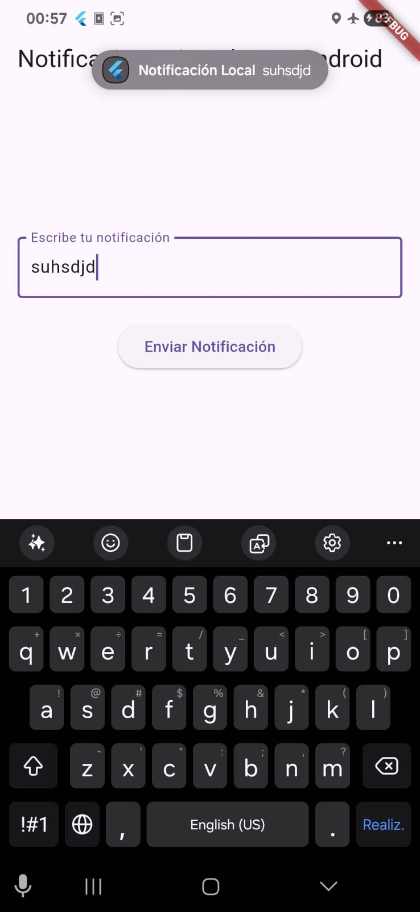

# 📲 Notificaciones Locales en Flutter (Android)

Este proyecto muestra cómo enviar **notificaciones locales** en Flutter, específicamente para Android.

---

## 🚀 ¿Qué hace?

Una pantalla simple con:
- 📝 Campo de texto para escribir un mensaje
- 🔘 Botón para enviar una notificación local con el mensaje

---

## ⚙️ Instalación

### 1. Clonar y abrir el proyecto

```bash
git clone https://github.com/tu-usuario/notificaciones_locales_android.git
cd notificaciones_locales_android
```

### 2. Obtener dependencias

```bash
flutter pub get
```

### 3. Ejecutar

```bash
flutter run
```

---

## 🧱 Dependencias principales

```yaml
dependencies:
  flutter:
    sdk: flutter
  flutter_local_notifications: ^17.1.2
```

---

## 🛠️ Configuración Android requerida

### Permisos en AndroidManifest.xml

En `android/app/src/main/AndroidManifest.xml`, dentro de `<manifest>`:

```xml
<uses-permission android:name="android.permission.POST_NOTIFICATIONS"/>
```

### Configuración del ícono de notificación

Dentro de `<application>`:

```xml
<meta-data
  android:name="com.google.firebase.messaging.default_notification_icon"
  android:resource="@drawable/ic_stat_name" />
```

⚠️ **Si no tienes un ícono llamado `ic_stat_name`, usa uno del sistema:**
```xml
android:resource="@android:drawable/ic_dialog_info"
```

---

## 🧩 Correcciones aplicadas

### Error solucionado:
```
resource drawable/ic_stat_name not found
```
✅ Se corrigió añadiendo un ícono personalizado o usando uno del sistema.

### build.gradle actualizado:
Se ajustaron versiones de plugins para compatibilidad:

```groovy
plugins {
  id("com.android.application") version "8.7.3"
  id("org.jetbrains.kotlin.android") version "2.1.0"
}
```

---
## Captura de pantalla
### Permisos solicitados al iniciar la app
<!-- en folder images -->

### Pantalla principal

### Notificación enviada

---
## ✅ Resultado

Una app funcional para enviar notificaciones locales directamente desde el dispositivo Android, con permisos solicitados y personalización básica.